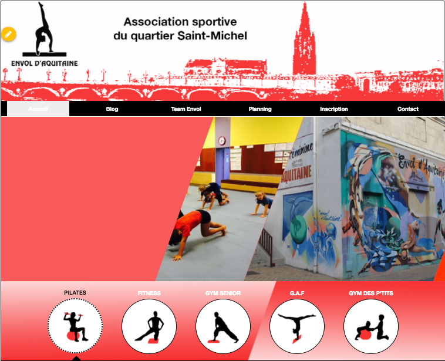
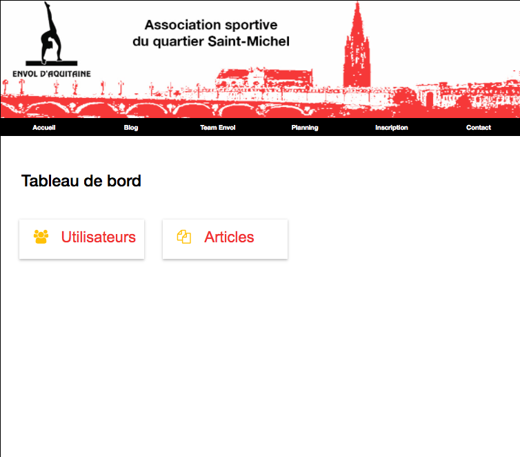

# Envol-Aquitaine


CMS Project with [MEAN stack](http://mean.io/#!/)

### Previews
| Home   |      Edition      | Dashboard |
|:----------:|:-------------:|:------:|
|    |     |  |

[Show demo](http://envol-aquitaine.wildcodeschool.fr/#!/)

### Prerequisites
* [NodeJS](https://nodejs.org/en/)
* [MongoDB](https://www.mongodb.com/)
* [Brunch](http://brunch.io/)
* [Bower](https://bower.io/)

### Installation

```bash
git clone https://github.com/WildCodeSchool/bordeaux-0916-envol-aquitaine.git  
cd bordeaux-0916-envol-aquitaine
bower i
npm i
```

__Default account__
> Email : admin@domain.ext  
> Password : admin

### Development

`npm run dev`

### Production

`npm start`

### Contributing

1. Fork it!
2. Create your feature branch: git checkout -b my-new-feature
3. Commit your changes: git commit -am 'Add some feature'
4. Push to the branch: git push origin my-new-feature
5. Submit a pull request

### Licence

This project is licensed under the MIT Open Source license. For more information, see the LICENSE file in this repository.
